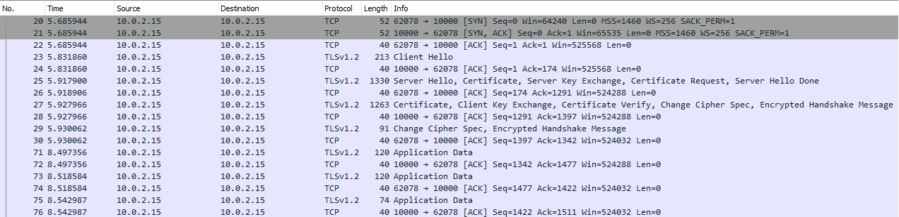
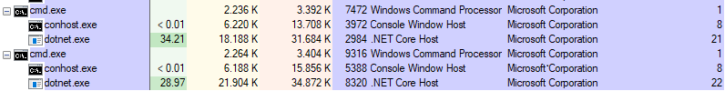

# AsyncTlsSocketEchoServerClient

This project implements a high-performance, asynchronous, TLS socket
echo server and client. The client and server authenticate using
provided self-signed certificates.

## Compilation

    % cd src
    % dotnet build

## Generating and installing certificates

Make sure PowerShell is running as administrator and change directory
to repository's root folder.

The PowerShell commands below generate a certificate for a root
certificate authority as well as self-signed server and client
certificates:

    $params = @{
        DnsName = "Bugfree.dk Root CA"
        KeyLength = 2048
        KeyAlgorithm = "RSA"
        HashAlgorithm = "SHA256"
        KeyExportPolicy = "Exportable"
        NotAfter = (Get-Date).AddYears(5)
        CertStoreLocation = "Cert:\LocalMachine\My"
        KeyUsage = 'CertSign','CRLSign'
    }
    $rootCA = New-SelfSignedCertificate @params

    $params = @{
        DnsName = "server.bugfree.dk"
        Signer = $rootCA
        KeyLength = 2048
        KeyAlgorithm = 'RSA'
        HashAlgorithm = 'SHA256'
        KeyExportPolicy = 'Exportable'
        NotAfter = (Get-date).AddYears(5)
        CertStoreLocation = 'Cert:\LocalMachine\My'
    }
    $serverCert = New-SelfSignedCertificate @params

    $params = @{
        DnsName = "client.bugfree.dk"
        Signer = $rootCA
        KeyLength = 2048
        KeyAlgorithm = 'RSA'
        HashAlgorithm = 'SHA256'
        KeyExportPolicy = 'Exportable'
        NotAfter = (Get-date).AddYears(5)
        CertStoreLocation = 'Cert:\LocalMachine\My'
    }
    $clientCert = New-SelfSignedCertificate @params

For mutual client and server authentication, only Bugfree.rootCA.crt
must be installed in "Local computer -> Trusted Root Certification
Authorities" (see Import-Certificate invocation below). A new
certificate can only be installed/created in the My store. Thus we
need to export and import the root CA into the Root store:

    Export-Certificate -Cert $rootCA -FilePath "certificates\Bugfree.rootCA.crt"
    Import-Certificate -CertStoreLocation 'Cert:\LocalMachine\Root' -FilePath "certificates\Bugfree.rootCA.crt"

When the client and server run, they load certificates from the file
system (we could also have loaded those from the My Store). For mutual
authentication to work, the exported certificates must contain both
public and private keys:

    Export-PfxCertificate -Cert $serverCert -FilePath "certificates\server.bugfree.dk.pfx" -Password (ConvertTo-SecureString -AsPlainText 'securepw' -Force)
    Export-PfxCertificate -Cert $clientCert -FilePath "certificates\client.bugfree.dk.pfx" -Password (ConvertTo-SecureString -AsPlainText 'securepw' -Force)

## Running server and client

After modifying the server's IP address within server.ps1 and
client.ps1, run the scripts in separate PowerShell terminals (or run
the solution from Visual Studio which starts up both server and
client).

    % ./server.ps1
    % ./client.ps1

When a client connects to the server, the server writes the following
to standard output:

    Server started. Press any key to stop server.
    --------------------------------------------------------------------------------
    Waiting for a connection
    CipherAlgorithm: Aes256
    CipherStrength: 256
    HashAlgorithm: Sha384
    IsAuthenticated: True
    IsEncrypted: True
    IsMutuallyAuthenticated: True
    IsServer: True
    IsSigned: True
    SslProtocol: Tls12
    RemoteCertificate.Issuer: CN=Bugfree.dk Root CA
    RemoteCertificate.Subject: CN=client.bugfree.dk
    RemoteCertificate.Thumbprint: DB9E556C62962D263AFCFE1DDD03D78A9E7EA6E6
    LocalCertificate.Issuer: CN=Bugfree.dk Root CA
    LocalCertificate.Subject: CN=server.bugfree.dk
    LocalCertificate.Thumbprint: 4ED647A481728AFA87B5A66223E00AF21F316288
    Client connection 10.0.2.15:62078 accepted. 1 clients connected to server
    Waiting for a connection

Note how the remote and local certificates match the ones generated
and signed by the Root CA. Also, IsMutuallyAuthenticated is true
because both client and server has authenticated.

On the client, the following is written to standard output:

    Connected 10.0.2.15:62078 to server
    CipherAlgorithm: Aes256
    CipherStrength: 256
    HashAlgorithm: Sha384
    IsAuthenticated: True
    IsEncrypted: True
    IsMutuallyAuthenticated: True
    IsServer: False
    IsSigned: True
    SslProtocol: Tls12
    RemoteCertificate.Issuer: CN=Bugfree.dk Root CA
    RemoteCertificate.Subject: CN=server.bugfree.dk
    RemoteCertificate.Thumbprint: 4ED647A481728AFA87B5A66223E00AF21F316288
    LocalCertificate.Issuer: CN=Bugfree.dk Root CA
    LocalCertificate.Subject: CN=client.bugfree.dk
    LocalCertificate.Thumbprint: DB9E556C62962D263AFCFE1DDD03D78A9E7EA6E6
    Clients connected. Press any key start sending and receiving.

Again, we see the same certificates as on the server, but switched
around.

Press any key on the client to start sending/receiving random messages
of between 1 and 100 bytes. Leave the client running for some time and
then either press any key on the server or client and observe the
clients disconnect.
       
On the wire, here's what the TCP handshake, TLS handshake, and the
sending and receiving of a couple of random messages look like:

## Performance test

The following test was run on an Intel Core i7-7560U CPU @ 2.4 GHz
with four cores. Both client and server ran on the same VirtualBox
Windows 10 machine on a Linux host.

The test involved connecting 64 clients to the server and have each
send and receive at maximum speed. Then after one minute we halt the
server and the following statistics is displayed:

    Read operations: 1834271
    Write operations: 1834208
    Bytes received: 92655985
    Bytes sent: 92652635

That's 1.8 million round-trips per minute and given the random message
length of between 1 and 100 bytes, the average message size is about
50 bytes. On the wire, each message is slightly larger due to
encryption. Still, that about 478 round-trips per client per second.

Here's Process Explorer showing the server (top) and client (bottom)
busy sending and receiving messages. The server is using about 18MB
private memory and multiplexing the 64 clients across 21 threads.

## References

- On Windows, capturing localhost traffic isn't supported by
  Wireshark. Instead, use a tool such as
  [RawCap](http://www.netresec.com/?page=RawCap) to generate the pcap
  file.

- For an introduction to async programming, see [JeremyBytes Live! -
  I'll Get Back to You: Task, Await, and Asynchronous Methods in
  C#](https://www.youtube.com/watch?v=B2HDDKq4d3c).

- For an introduction HTTPS packet analysis with Wireshark, see [The
  First Few Milliseconds of an HTTPS
  Connection](http://www.moserware.com/2009/06/first-few-milliseconds-of-https.html).
