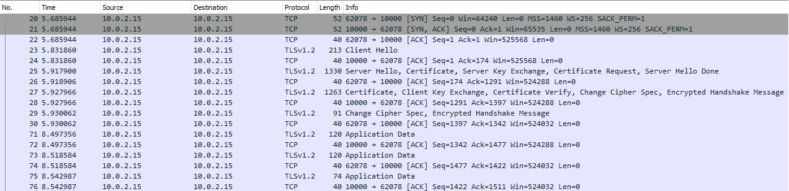

# AsyncTlsSocketEchoServerClient

This project implements an asynchronous, TLS-secured socket echo server and client. It shows how to construct a robust, high performance client and server and how to authenticate each party using self-signed certificates.

## Building code

    % cd AsyncTlsSocketEchoServerClient/src
    % dotnet build

## Generating and installing certificates

Make sure PowerShell is running as administrator and change directory to the root folder of this project.

The script below generates a root certificate as well as self-signed server and client certificates, provided in the certificates folder. Only Bugfree.rootCA.crt will need to be installed into "Local computer -> Trusted Root Certification Authorities" for the client and server to run (see Import-Certificate cmdlet below): 

    $params = @{
        DnsName = "Bugfree.dk Root CA"
        KeyLength = 2048
        KeyAlgorithm = "RSA"
        HashAlgorithm = "SHA256"
        KeyExportPolicy = "Exportable"
        NotAfter = (Get-Date).AddYears(5)
        CertStoreLocation = "Cert:\LocalMachine\My"
        KeyUsage = 'CertSign','CRLSign'
    }
    $rootCA = New-SelfSignedCertificate @params

    $params = @{
        DnsName = "server.bugfree.dk"
        Signer = $rootCA
        KeyLength = 2048
        KeyAlgorithm = 'RSA'
        HashAlgorithm = 'SHA256'
        KeyExportPolicy = 'Exportable'
        NotAfter = (Get-date).AddYears(5)
        CertStoreLocation = 'Cert:\LocalMachine\My'
    }
    $serverCert = New-SelfSignedCertificate @params

    $params = @{
        DnsName = "client.bugfree.dk"
        Signer = $rootCA
        KeyLength = 2048
        KeyAlgorithm = 'RSA'
        HashAlgorithm = 'SHA256'
        KeyExportPolicy = 'Exportable'
        NotAfter = (Get-date).AddYears(5)
        CertStoreLocation = 'Cert:\LocalMachine\My'
    }
    $clientCert = New-SelfSignedCertificate @params

A new certificate can only be installed into the My store so we need to export and import the root CA into the Root store:
    
    Export-Certificate -Cert $rootCA -FilePath "certificates\Bugfree.rootCA.crt"
    Import-Certificate -CertStoreLocation 'Cert:\LocalMachine\Root' -FilePath "certificates\Bugfree.rootCA.crt"
    
We can leave the client and server certificates in the My store and refer to their location in code. Alternatively we can refer to their location in the filesystem. For the client and server, the exported certificates must hold both the public and private keys:

    Export-PfxCertificate -Cert $serverCert -FilePath "certificates\server.bugfree.dk.pfx" -Password (ConvertTo-SecureString -AsPlainText 'securepw' -Force)
    Export-PfxCertificate -Cert $clientCert -FilePath "certificates\client.bugfree.dk.pfx" -Password (ConvertTo-SecureString -AsPlainText 'securepw' -Force)

## Running server and client

After modifying server.ps1 and client.ps1 to contain the correct server IP address, run the scripts in separate Powershell terminal (or run solution from Visual Studio).

    % ./server.ps1
    % ./client.ps1

When a client connects to the server, the server displays the following:

    Server started. Press any key to stop server.
    --------------------------------------------------------------------------------
    Waiting for a connection
    CipherAlgorithm: Aes256
    CipherStrength: 256
    HashAlgorithm: Sha384
    IsAuthenticated: True
    IsEncrypted: True
    IsMutuallyAuthenticated: True
    IsServer: True
    IsSigned: True
    SslProtocol: Tls12
    RemoteCertificate.Issuer: CN=Bugfree.dk Root CA
    RemoteCertificate.Subject: CN=client.bugfree.dk
    RemoteCertificate.Thumbprint: DB9E556C62962D263AFCFE1DDD03D78A9E7EA6E6
    LocalCertificate.Issuer: CN=Bugfree.dk Root CA
    LocalCertificate.Subject: CN=server.bugfree.dk
    LocalCertificate.Thumbprint: 4ED647A481728AFA87B5A66223E00AF21F316288
    Client connection 10.0.2.15:62078 accepted. 1 clients connected to server
    Waiting for a connection

Note that the remote and local certificate match the ones just generated and that they're signed by our Root CA. Also note that IsMutuallyAuthenticated is true because both client and server authenticated to the other party.

On the client, it displays the following:

    Connected 10.0.2.15:62078 to server
    CipherAlgorithm: Aes256
    CipherStrength: 256
    HashAlgorithm: Sha384
    IsAuthenticated: True
    IsEncrypted: True
    IsMutuallyAuthenticated: True
    IsServer: False
    IsSigned: True
    SslProtocol: Tls12
    RemoteCertificate.Issuer: CN=Bugfree.dk Root CA
    RemoteCertificate.Subject: CN=server.bugfree.dk
    RemoteCertificate.Thumbprint: 4ED647A481728AFA87B5A66223E00AF21F316288
    LocalCertificate.Issuer: CN=Bugfree.dk Root CA
    LocalCertificate.Subject: CN=client.bugfree.dk
    LocalCertificate.Thumbprint: DB9E556C62962D263AFCFE1DDD03D78A9E7EA6E6
    Clients connected. Press any key start sending and receiving.

Here we also see the remote and local certificates, but switched around.

Press any key on the client to start sending/receiving random messages of between 1 and 100 bytes. Leave the client running for some time and then either press any key on the server or client.
       
On the wire, here's what the TCP handshake, TLS handshake, and the sending and receinging of a couple of random messages of different size looks like:

## Performance test

Connecting 64 clients to the server, each sending and receiving at maximum speed, halting the server after one minute results in the statistics below being shown. The test was run on an Intel Core i7-7560U CPU @ 2.4 GHz with four cores. Both client and server ran on the same machine:

    Read operations: 1834271
    Write operations: 1834208
    Bytes received: 92655985
    Bytes sent: 92652635

That's 1.8 million round-trips per minute and given the random message length of between 1 and 100 bytes, the average message size is about 50 bytes. On the wire it's slightly more as the messages are padded as part of the encryption. Still, that about 478 round-trips per client per second.

Here's Process Explorer showing the server (top) and client (bottom) sending and receiving messages. The server is using about 18MB private memory and multiplexes the 64 clients across 21 threads.

## References

- On Windows, capturing localhost traffic isn't supported by Wireshark. Instead, use a tool such as [RawCap](http://www.netresec.com/?page=RawCap) to generate the pcap file.

- For an introduction to async programming, see [JeremyBytes Live! - I'll Get Back to You: Task, Await, and Asynchronous Methods in C#](https://www.youtube.com/watch?v=B2HDDKq4d3c).

- For an introduction HTTPS packet analysis with Wireshark, see [The First Few Milliseconds of an HTTPS Connection](http://www.moserware.com/2009/06/first-few-milliseconds-of-https.html).
